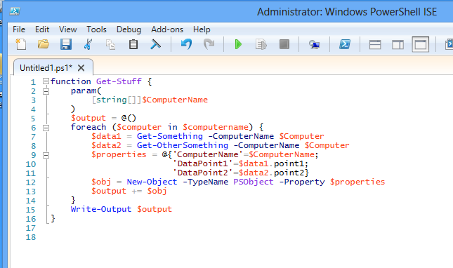
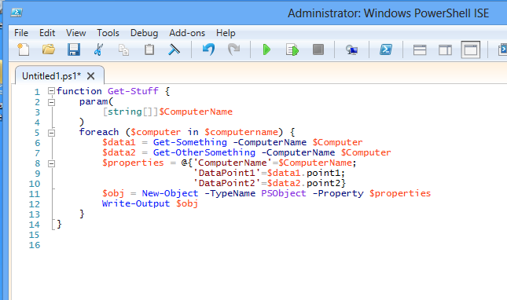

# Accumulating Output in a Function

This is a bit of an "advanced" gotcha, but it's one that many experienced developers will run into. Here's a very trimmed-down example, just to make the point (it isn't functional, as the command used is fictional):

The problem here is that the function can generate multiple output objects, and the programmer is accumulating those into the $output variable. That means this function won't output anything until it's completely finished running. That isn't how PowerShell commands (and functions _are_ commands) are usually meant to work.

PowerShell commands should _usually_ output each object to the pipeline, one at a time, as those objects are ready. That allows the _pipeline_ to accumulate the output, and to immediately pass it along to whatever is next in the pipeline. That's how PowerShell commands are intended to work. Now, there are always exceptions. Sort-Object, for example, _has_ to accumulate its output, because it can't actually sort anything until it has _all_ of them. So it's called a _blocking command, _because it "blocks" the pipeline from doing anything else until it produces its output. But that's an exception.

It's usually easy to fix this, by simply outputting to the pipeline instead of accumulating:

