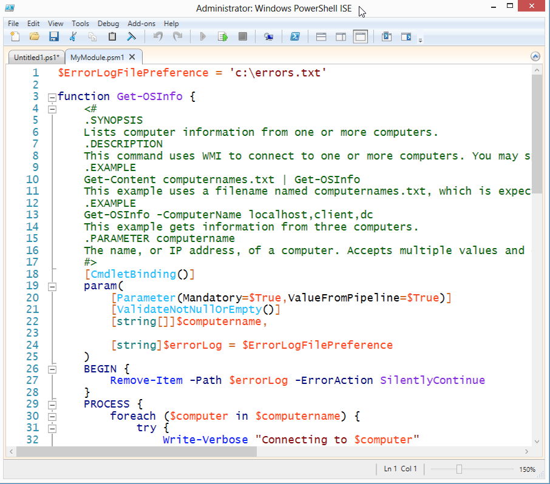

# [Bloody] {Awful} (Punctuation)
This isn't so much a "gotcha" as it is just plain confusing. PowerShell's nuts with the punctuation.

(Parentheses) are used to enclose expressions, such as the ForEach() construct's expression, and in certain cases to contain declarative syntax. You see that in the Param() block, and in the [Parameter()] attribute.

[Square brackets] are used around some attributes, like [CmdletBinding()], and around data types like [string], and to indicate arrays - as in [string[]]. They pop up a few other places, too.

{Curly brackets} nearly always contain executable code, as in the Try{} block, the BEGIN{} block, and the function itself. It's also used to express hash table literals (like @{}).

If your keyboard had a few dozen more buttons, PowerShell probably wouldn't have had to have all these overlapping uses of punctuation. But it does. At this point, they're pretty much just part of the shell's "cost of entry," and you'll have to get used to them.

