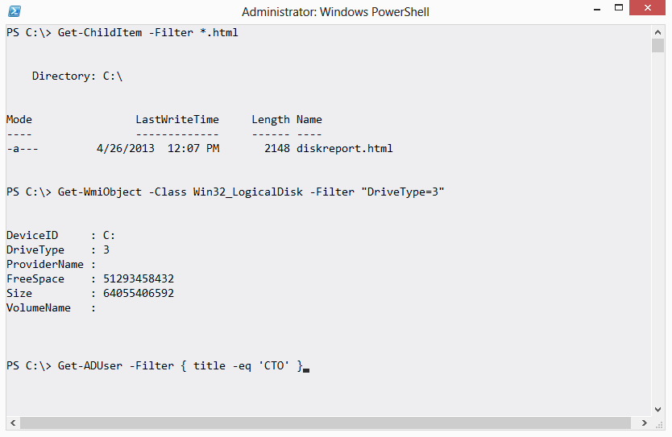

# -Filter Values Diversity
Here's one of the toughest things to get used to in PowerShell:

Here you see three commands, each using a -Filter parameter. Every one of those filters is different.

1. With Get-ChildItem, -Filter accepts file system wildcards like \*.
2. With Get-WmiObject, -Filter requires a string, and uses programming-style operators (like = for equality).
3. With Get-ADUser, -Filter wanted a script block, and accepted PowerShell-style comparison operators (like -eq for equality).

Here's how I think of it: When you use a -Filter parameter, PowerShell isn't processing the filtering. Instead, the filtration criteria is being handed down to the underlying technology, like the file system, or WMI, or Active Directory. That technology gets to decide what kind of filter criteria it will accept. PowerShell is just the middleman. So you have to carefully read the help, and maybe look for examples, to understand how the underlying technology needs you to specify its filter.

Yeah, it'd be nice if PowerShell just translated for you (that's actually what Get-ADUser does - the command translates that into an LDAP filter under the hood). But, usually, it doesn't.
