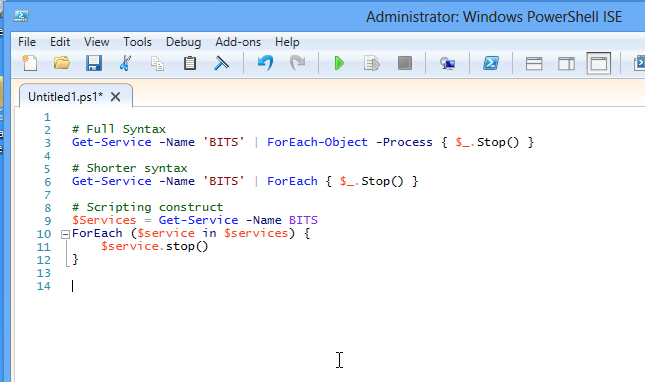

# ForEach vs ForEach vs ForEach
PowerShell's three lookalike friends can confusing, especially for newcomers. Basically, you've got two entities:

- The ForEach-Object cmdlet, which has an alias ForEach (it also has the alias %). This is meant to operate in the pipeline, and it uses a ?Process parameter that accepts a scriptblock.
- The ForEach scripting construct. This has a specific syntax, is not intended to be used in the pipeline, and does not have an alias.

Here's all three in action, in a very simplistic example:

The big difference is that, in the pipeline, ForEach-Object _processes one object at a time. _That means it can be slower, since that scriptblock must be interpreted on each iteration. It also tends to use less memory, since objects streaming down the pipeline one at a time don't all have to be bunched up in a variable first.

The scripting construct tends to be faster, but it often has more memory overhead, because you have to give it the entire collection of objects at once, instead of streaming objects into it one at a time.

Both use vaguely similar syntax, but there are differences. It's important to understand **that they are not the same,** and that they execute differently. It's confusing because "ForEach" is both an alias and a scripting construct; the shell determines which you're using by looking at the context in which you're using it.
