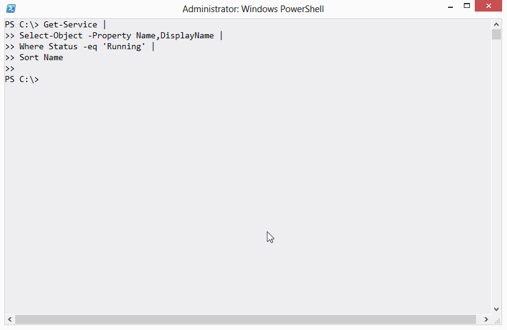
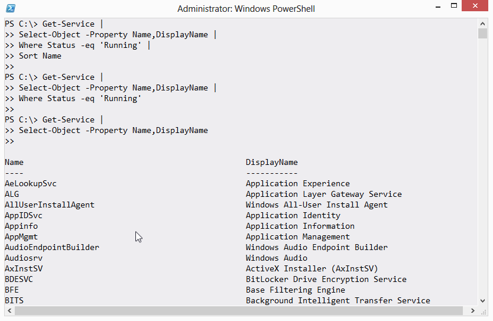
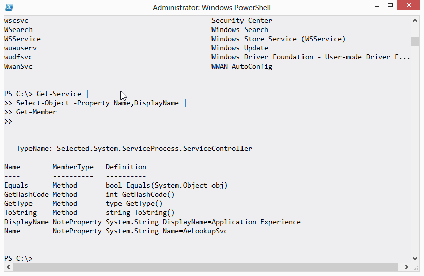

# You Can’t Have What You Don’t Have

Can you see what's wrong with this approach?

I mean, I'm pretty sure I have some running services, which is what this was supposed to display.

If you don't see the answer right away - or frankly, even if you do - this is a good time to talk about how to troubleshoot long command lines. Start, as I always say, by backing off a step. Delete the last command, and see if that does anything different.

In this case, I removed the Sort-Object (Sort) command, and nothing different happened. So that wasn't causing the problem. Next, I removed the Where-Object (Where, using v3 short syntax) command, and ah-ha! I got output. So something broke with Where-Object. Let's take what did work and pipe it to Get-Member, to see what's in the pipeline after Select-Object runs.

OK, I have an object that has a DisplayName property and a Name property.

And my Where-Object command was checking the Status property. Do you see a Status property? No, you do not. My error is that I removed the Status property when I didn't include it in the property list of Select-Object. So Where-Object had nothing to work with, so it returned nothing.

(Yeah, it'd be cooler if it threw an error - "Hey, you said to filter on the Status property, and there ain't one!" - but that isn't how it works.)

Moral of the story: Pay attention to what's in the pipeline. You can't work with something you don't have, and you might have taken it away yourself. You won't always get a helpful error message, so sometimes you'll need to dig in and figure it out another way - such as backing off a step.

